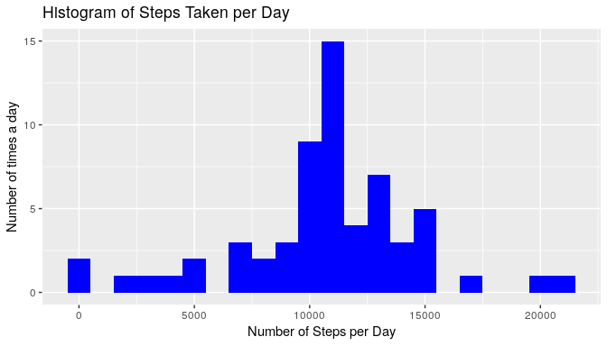
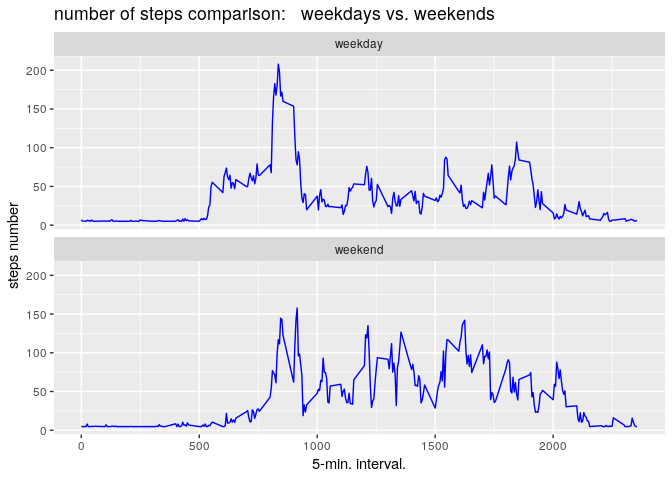

[url link for an inline html preview:](http://htmlpreview.github.io/?https://github.com/chatard/RepData_PeerAssessment1/blob/master/PA1_template.html)

## Loading and preprocessing the data

### Preliminary settings and libraries packages:
#### Local date and time settings for US compatibility 


```r
Sys.setlocale("LC_TIME","en_US.UTF-8")
```

```
## [1] "en_US.UTF-8"
```

#### Knitr options:  


####Loading basic packages.


```r
library(dplyr)
```

```
## 
## Attaching package: 'dplyr'
```

```
## The following objects are masked from 'package:stats':
## 
##     filter, lag
```

```
## The following objects are masked from 'package:base':
## 
##     intersect, setdiff, setequal, union
```

```r
library(ggplot2)
```

### Loading data:  


```r
        if(!file.exists("activity.csv")){
        unzip("activity.zip")
        }
data<- read.csv("activity.csv")
```


###Data characteristics:

#### brief look:  


```r
str(data)
```

```
## 'data.frame':	17568 obs. of  3 variables:
##  $ steps   : int  NA NA NA NA NA NA NA NA NA NA ...
##  $ date    : Factor w/ 61 levels "2012-10-01","2012-10-02",..: 1 1 1 1 1 1 1 1 1 1 ...
##  $ interval: int  0 5 10 15 20 25 30 35 40 45 ...
```

#### dimensions:


```r
dim(data)
```

```
## [1] 17568     3
```

## What is mean total number of steps taken per day?

To calculate this mean value,  we must know the value $S_{i}$ for each day which is 
equal to the total of steps per day and then sum all Si: $\sum S_{i}$ ... then divide by 
the number of days. 
Or, which is the same thing, calculate mean(S)
which is the mean of the variable S.


```r
grdata<- data %>%
        group_by(date)%>%
        summarise(stepsmeanbyday=sum(steps, na.rm = TRUE))
```


###Making a histogram of the total number of steps taken each day:        


```r
ggplot(grdata, aes(x = stepsmeanbyday)) + 
        geom_histogram(fill = "blue", binwidth = 1000)+
        labs(title="Histogram of Steps Taken per Day", 
             x="Number of Steps per Day",
             y="Number of times in a day")
```

<!-- -->


### Mean and median of the total number of steps taken per day:  
    


```r
  grmean<- mean(grdata$stepsmeanbyday, na.rm = TRUE)
```
  mean  =   9354.22950819672
  

```r
grmedian <- median(grdata$stepsmeanbyday, na.rm = TRUE)
```

median =   10395


## What is the average daily activity pattern?  


```r
dataclone<-data 
dataclone$interval.factor <- factor(dataclone$interval)
```


```r
data_interval<-dataclone%>% 
                group_by(interval) %>%
                summarise(stepsmean=mean(steps, na.rm = TRUE))
```


```r
data_interval$stepsmean<-as.numeric(data_interval$stepsmean)
```

###time series plot  of the 5-minute interval (x-axis) and the average number of steps taken, averaged across all days (y-axis):   


```r
ggplot(data_interval, aes(interval, stepsmean)) +
        geom_line(col="blue")+
        labs(title="Average Daily activity pattern",
             x="x-axis:five minutes intervals", y="average number of steps")
```

<!-- -->

###Which 5-minute interval, on average across all the days in the dataset, contains the maximum number of steps?  

#### maximum number of steps:


```r
maxisteps<-max(data_interval$stepsmean)
```

maximum nb. of steps = 206.169811320755

#### 5-minute interval that contains the maximum number of steps:


```r
maxi5interval<-data_interval$interval[which.max(data_interval$stepsmean)]
```

maxi-5 interval = 835

## Imputing missing values

###total number of missing values in the dataset:   


```r
totalNA<-sum(is.na(data))
```

**totalNA** = 2304  

###strategy for filling in all of the missing values in the dataset:

the simplest strategy would be to replace the missing values by the average number of steps  by example. 

an other strategy could be to replace missing values by median of number of steps.

###new dataset that is equal to the original dataset but with the missing data filled in:


```r
modifieddata <- data
modifieddata$steps[is.na(modifieddata$steps)]<- mean(data$steps, na.rm = TRUE)
```

### histogram of the total number of steps taken each day:  


```r
grmodifieddata<- modifieddata %>%
        group_by(date)%>%
        summarise(daysteps=sum(steps, na.rm = TRUE))
```


```r
ggplot(grmodifieddata, aes(x = daysteps)) + 
        geom_histogram(fill = "blue", binwidth = 1000)+
        labs(title="Histogram of Steps Taken per Day", 
             x="Number of Steps per Day",
             y="Number of times a day")
```

<!-- -->

###Calculate and report the mean and median total number of steps taken per day:  


```r
newmeansteps<-mean(grmodifieddata$daysteps)
newmediansteps<-median(grmodifieddata$daysteps)
```

**newmeansteps** = 10766.1886792453  
**newmediansteps** = 10766.1886792453

###Do these values differ from the estimates from the first part of the assignment?  


**yes these values are different from values calculated in our first part.**

###What is the impact of imputing missing data on the estimates of the total daily number of steps?

**The value of the median has increased. Now we have médiane equal mean.**

It seems to be in favor of a normal distribution.


```r
str(grmodifieddata)
```

```
## Classes 'tbl_df', 'tbl' and 'data.frame':	61 obs. of  2 variables:
##  $ date    : Factor w/ 61 levels "2012-10-01","2012-10-02",..: 1 2 3 4 5 6 7 8 9 10 ...
##  $ daysteps: num  10766 126 11352 12116 13294 ...
```


## Are there differences in activity patterns between weekdays and weekends?  

###Create a new factor variable in the dataset with two levels – “weekday” and “weekend” indicating whether a given date is a weekday or weekend day:


```r
# grmodifieddata$week <- ifelse(weekdays(as.Date(grmodifieddata$date)) %in% c("Saturday", "Sunday"), "weekend", "weekday")
# grmodifieddata$week<- as.factor(grmodifieddata$week)
Sys.setlocale("LC_TIME","en_US.UTF-8")
```

```
## [1] "en_US.UTF-8"
```

```r
modifieddata$week <- ifelse(weekdays(as.Date(modifieddata$date)) %in% c("Saturday", "Sunday"),
"weekend", "weekday")
modifieddata$week<- as.factor(modifieddata$week)
```


```r
str(modifieddata)
```

```
## 'data.frame':	17568 obs. of  4 variables:
##  $ steps   : num  37.4 37.4 37.4 37.4 37.4 ...
##  $ date    : Factor w/ 61 levels "2012-10-01","2012-10-02",..: 1 1 1 1 1 1 1 1 1 1 ...
##  $ interval: int  0 5 10 15 20 25 30 35 40 45 ...
##  $ week    : Factor w/ 2 levels "weekday","weekend": 1 1 1 1 1 1 1 1 1 1 ...
```


```r
wdmodifieddata<- modifieddata %>%
        group_by(week, interval)%>%
        summarise(wdsteps=mean(steps))
str(wdmodifieddata)
```

```
## Classes 'grouped_df', 'tbl_df', 'tbl' and 'data.frame':	576 obs. of  3 variables:
##  $ week    : Factor w/ 2 levels "weekday","weekend": 1 1 1 1 1 1 1 1 1 1 ...
##  $ interval: int  0 5 10 15 20 25 30 35 40 45 ...
##  $ wdsteps : num  7.01 5.38 5.14 5.16 5.07 ...
##  - attr(*, "vars")= chr "week"
##  - attr(*, "drop")= logi TRUE
```


```r
ggplot(wdmodifieddata, aes(x=interval, y=wdsteps)) + 
        geom_line(col="blue") + 
        facet_wrap(~ week, nrow=2, ncol=1) +
        labs(x="5-min. interval.", y="steps number",
             title="number of steps comparison:   weekdays vs. weekends")
```

<!-- -->

**finally: it seems that it is possible to highlight a difference depending on whether it is weekend or weekdays.**

