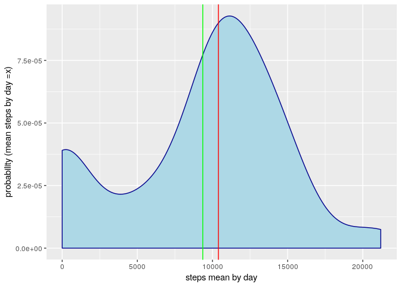
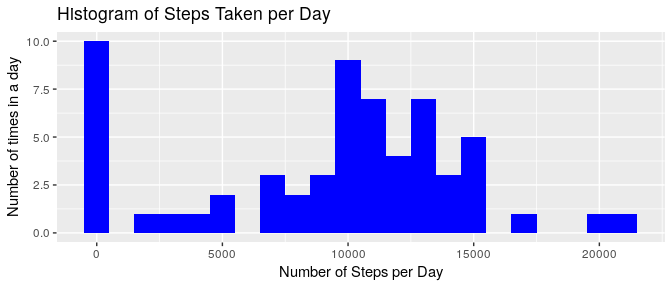

# Peer Assignment 1 :    

[inline html preview:](http://htmlpreview.github.io/?https://github.com/chatard/RepData_PeerAssessment1/blob/master/PA1_template.html)

## Loading and preprocessing the data

### Preliminary settings:
#### Local date and time settings for US compatibility 


```r
Sys.setlocale("LC_TIME","en_US.UTF-8")
```

```
## [1] "en_US.UTF-8"
```

#### Knitr options:  


####Loading basic packages.


```r
library(dplyr)
```

```
## 
## Attaching package: 'dplyr'
```

```
## The following objects are masked from 'package:stats':
## 
##     filter, lag
```

```
## The following objects are masked from 'package:base':
## 
##     intersect, setdiff, setequal, union
```

```r
library(ggplot2)
```

### Loading data:  


```r
        if(!file.exists("activity.csv")){
        unzip("activity.zip")
        }
data<- read.csv("activity.csv")
```


###Data characteristics:

#### brief look:  


```r
str(data)
```

```
## 'data.frame':	17568 obs. of  3 variables:
##  $ steps   : int  NA NA NA NA NA NA NA NA NA NA ...
##  $ date    : Factor w/ 61 levels "2012-10-01","2012-10-02",..: 1 1 1 1 1 1 1 1 1 1 ...
##  $ interval: int  0 5 10 15 20 25 30 35 40 45 ...
```

#### dimensions:


```r
dim(data)
```

```
## [1] 17568     3
```

## What is mean total number of steps taken per day?

To calculate this mean value,  we must know the value Si for each day which is 
equal to the total of steps per day and then sum all Si ... then divide by 
the number of days. 
Or, which is the same thing, calculate mean(S)
which is the mean of the variable S.


```r
grdata<- data %>%
        group_by(date)%>%
        summarise(stepsmeanbyday=sum(steps, na.rm = TRUE))
```


```r
p <- ggplot(grdata, aes(x=stepsmeanbyday)) + 
        geom_density(color="darkblue", fill="lightblue") +
        labs(x= "steps mean by day", y= "probability (mean steps by day =x)")+
        geom_vline(aes( xintercept = mean(stepsmeanbyday) ),
        linetype=  "solid", color =  "green" ) +
        geom_vline(aes( xintercept =median(stepsmeanbyday) ),
                   linetype=  "solid", color =  "red" )    
```


```r
p
```

<!-- -->


###Making a histogram of the total number of steps taken each day:        


```r
ggplot(grdata, aes(x = stepsmeanbyday)) + 
        geom_histogram(fill = "blue", binwidth = 1000)
```

<!-- -->

## What is the average daily activity pattern?


## Imputing missing values


## Are there differences in activity patterns between weekdays and weekends?
