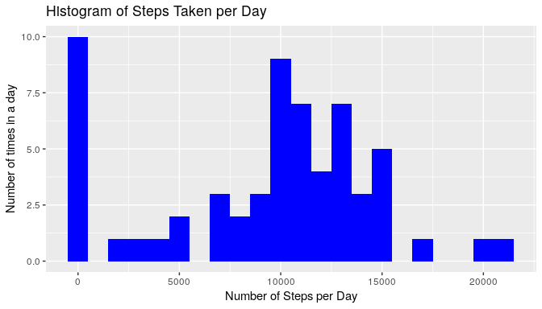

# Peer Assignment 1 :    

[inline html preview:](http://htmlpreview.github.io/?https://github.com/chatard/RepData_PeerAssessment1/blob/master/PA1_template.html)

## Loading and preprocessing the data

### Preliminary settings and libraries packages:
#### Local date and time settings for US compatibility 


```r
Sys.setlocale("LC_TIME","en_US.UTF-8")
```

```
## [1] "en_US.UTF-8"
```

#### Knitr options:  


####Loading basic packages.


```r
library(dplyr)
```

```
## 
## Attaching package: 'dplyr'
```

```
## The following objects are masked from 'package:stats':
## 
##     filter, lag
```

```
## The following objects are masked from 'package:base':
## 
##     intersect, setdiff, setequal, union
```

```r
library(ggplot2)
```

### Loading data:  


```r
        if(!file.exists("activity.csv")){
        unzip("activity.zip")
        }
data<- read.csv("activity.csv")
```


###Data characteristics:

#### brief look:  


```r
str(data)
```

```
## 'data.frame':	17568 obs. of  3 variables:
##  $ steps   : int  NA NA NA NA NA NA NA NA NA NA ...
##  $ date    : Factor w/ 61 levels "2012-10-01","2012-10-02",..: 1 1 1 1 1 1 1 1 1 1 ...
##  $ interval: int  0 5 10 15 20 25 30 35 40 45 ...
```

#### dimensions:


```r
dim(data)
```

```
## [1] 17568     3
```

## What is mean total number of steps taken per day?

To calculate this mean value,  we must know the value $S_{i}$ for each day which is 
equal to the total of steps per day and then sum all Si: $\sum S_{i}$ ... then divide by 
the number of days. 
Or, which is the same thing, calculate mean(S)
which is the mean of the variable S.


```r
grdata<- data %>%
        group_by(date)%>%
        summarise(stepsmeanbyday=sum(steps, na.rm = TRUE))
```


```r
p <- ggplot(grdata, aes(x=stepsmeanbyday)) + 
        geom_density(color="darkblue", fill="lightblue") +
        labs(x= "steps mean by day", y= "probability (mean steps by day =x)")+
        geom_vline(aes( xintercept = mean(stepsmeanbyday) ),
        linetype=  "solid", color =  "green" ) +
        geom_vline(aes( xintercept =median(stepsmeanbyday) ),
                   linetype=  "solid", color =  "red" )    
```


```r
p
```

<!-- -->


###Making a histogram of the total number of steps taken each day:        


```r
ggplot(grdata, aes(x = stepsmeanbyday)) + 
        geom_histogram(fill = "blue", binwidth = 1000)+
        labs(title="Histogram of Steps Taken per Day", 
             x="Number of Steps per Day",
             y="Number of times in a day")
```

<!-- -->


### Mean and median of the total number of steps taken per day:  
    


```r
  grmean<- mean(grdata$stepsmeanbyday, na.rm = TRUE)
```
  mean  =   9354.22950819672
  

```r
grmedian <- median(grdata$stepsmeanbyday, na.rm = TRUE)
```

median =   10395


## What is the average daily activity pattern?  


```r
dataclone<-data 
dataclone$interval.factor <- factor(dataclone$interval)
```


```r
data_interval<-dataclone%>% 
                group_by(interval) %>%
                summarise(stepsmean=mean(steps, na.rm = TRUE))
```


```r
data_interval$stepsmean<-as.numeric(data_interval$stepsmean)
```

###time series plot  of the 5-minute interval (x-axis) and the average number of steps taken, averaged across all days (y-axis):   


```r
#ggplot(data_interval, aes(interval, as.numeric(stepsmean))) +
        #geom_line(col="blue")
ggplot(data_interval, aes(interval, as.numeric(stepsmean))) +
        geom_line(col="blue")+
        labs(title="Average Daily activity pattern",
             x="x-axis:five minutes intervals", y="average number of steps")
```

<!-- -->

###Which 5-minute interval, on average across all the days in the dataset, contains the maximum number of steps?  

#### maximum number of steps:


```r
maxisteps<-max(data_interval$stepsmean)
```

maximum nb. of steps = 206.169811320755

#### 5-minute interval that contains the maximum number of steps:


```r
maxi5interval<-data_interval$interval[which.max(data_interval$stepsmean)]
```

maxi-5 interval = 835

## Imputing missing values


## Are there differences in activity patterns between weekdays and weekends?
